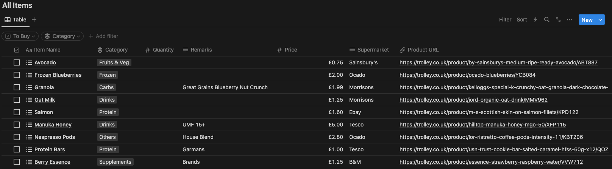

# Notion Template Meal Planner Price Updater


## Description

This project is to be used with the Meal Planner Notion template provided by Easlo (https://www.easlo.co/). Specifically it interacts with the ingredients database. It uses the product name to fetch the latest cheapest price and supermarket from Trolley.co.uk. This can be used without using this exact template but the database needs to contain the same headers as the template, an example of this is shown below.



### How it selects the correct product

The search is based on the item name taken from the Notion database, this is then fetches the first page of closest matches to that description and selects the item with the lowest price. The closest match is determined by Trolley.co.uk and the lowest price is determined in the script.

### Improvements to be made

#### Add string matching

Add string matching to the name of the item found, this makes finding the correct item more accurate providing better information.

#### Aggregate requests to Notion

Currently each modification to the database is made individually, this needs to change to aggregate the changes into a single request, reducing the calls made to the Notion API.

## Prerequisites

- Python >= 3.11.4
- Docker

## Dependancies

- beautifulsoup4 = 4.12.2
- NotionAPI = 0.1.2

## Install

### Compile NotionAPI library

Due to this being a custom library not yet available on PyPi you have to compile it available for pip to install

```
pip install wheel
```

```
python3 NotionAPI/setup.py sdist bdist_wheel
```

```
pip install NotionAPI/dist/NotionAPI-0.1.2-py3-none-any.whl
```

### Local Installation Cont.

```
python3 -m pip install -r requirements.txt
```

### Docker Installation

```
docker build -t notion-meal-price-updater .
```

## Usage

Both the Notion API token and the Database ID are fetched as environment variables

### Running outside of Docker

How to find the Notion API token

https://developers.notion.com/docs/create-a-notion-integration

How to get the database ID

https://neverproductive.com/database-id-notion/

```
export NOTIONTOKEN=VALUE
```
```
export DATABASEID=VALUE
```
```
python3 main.py
```

### Running using Docker

```
docker run -e NOTIONTOKEN=VALUE -e DATABASEID=VALUE -it --rm --name notion-meal-price-updater notion-meal-price-updater
```

## License

GPL V3 Benjamin Norman 2023
